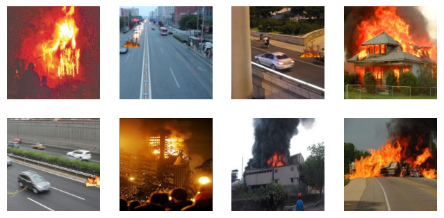

# **Fire Detection on images using Convolutional Neural Networks (CNN)**
## Author: Gregorio Mendoza Serrano

In this project we implement a Deep Neural Network (DNN) for image classification using an object recognition dataset. The goal is to design, train, and evaluate the neural network using deep learning techniques such as architecture selection, hyperparameter optimization, and result visualization.

### Key Steps:
1. **Data Preparation:** Load and preprocess the dataset.
2. **Architecture Design:** Select an appropriate deep neural network architecture.
3. **Model Training:** Train the neural network using the training data.
4. **Model Evaluation:** Evaluate the model's performance on the test set.
5. **Result Visualization:** Visualize examples of images and the predictions made by the neural network.

---

## Objective

During this exercise, we will train several convolutional neural networks (CNNs) for fire/flame detection in images, focusing on classification (Fire/No Fire). We will use a dataset of 10,000 images, half of which contain fire, while the other half do not.

As we develop the classification using CNNs, three different architectures will be explored (details provided throughout the notebook).

The **final goal** of the exercise is to provide:
- A **comparison of confusion matrices** for the models and the associated metrics.
- **Prediction examples** of images using the best-performing model.

---
## Deep Neural Network Architectures

When developing the classification using CNNs, we will study three different architectures:

1. **Model 1:** A simple CNN with 3 convolutional layers [sequences of 16, 32, and 64 filters], MaxPooling, and DropOut layers (25%) interspersed between the convolutional layers, along with a dense layer of 256 neurons followed by a 50% DropOut.

2. **Model 2:** A slightly deeper CNN with 6 convolutional layers [sequences of 32, 64, 128, 256, 256, and 512 filters], MaxPooling, and DropOut layers (25%) interspersed between the convolutional layers, and two dense layers with 215 and 64 neurons, respectively, both with a 50% DropOut afterward.

3. **Model 3:** A simplified Xception-type CNN, featuring 2 blocks of depthwise separable convolutions, iterated with a sequence of [32, 64, 128, 256] filters, which separates spatial and channel convolutions. This model is chosen for its effectiveness in detecting subtle details with complex boundaries in images (which is the case for fire).

---
Sample Fire images from the dataset:

Sample Non-Fire images from the dataset:

